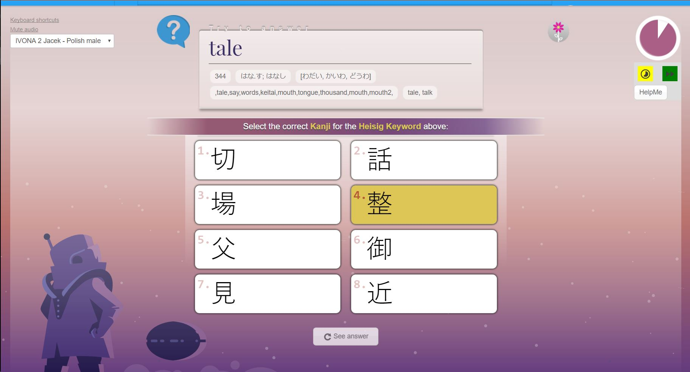
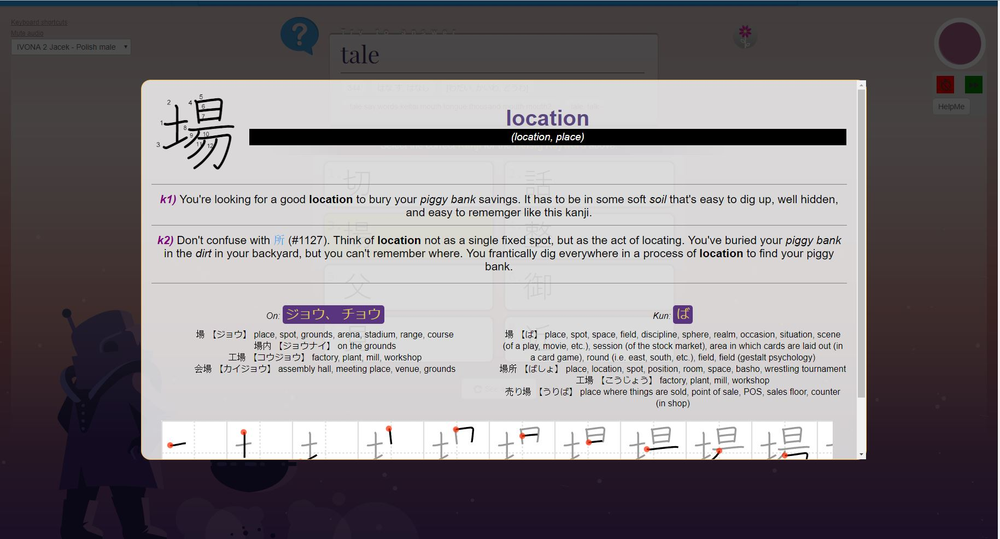
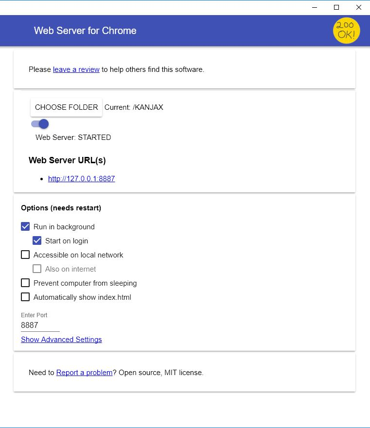
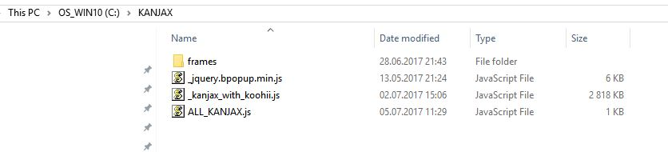
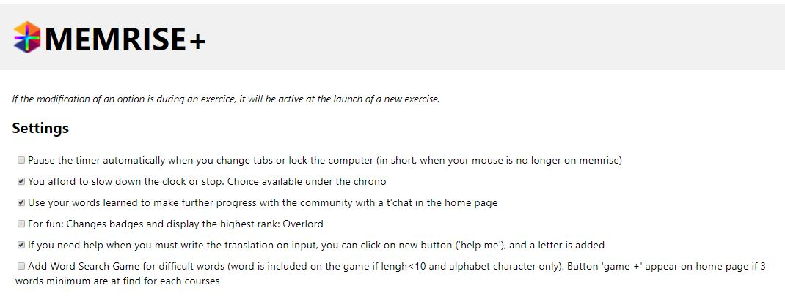
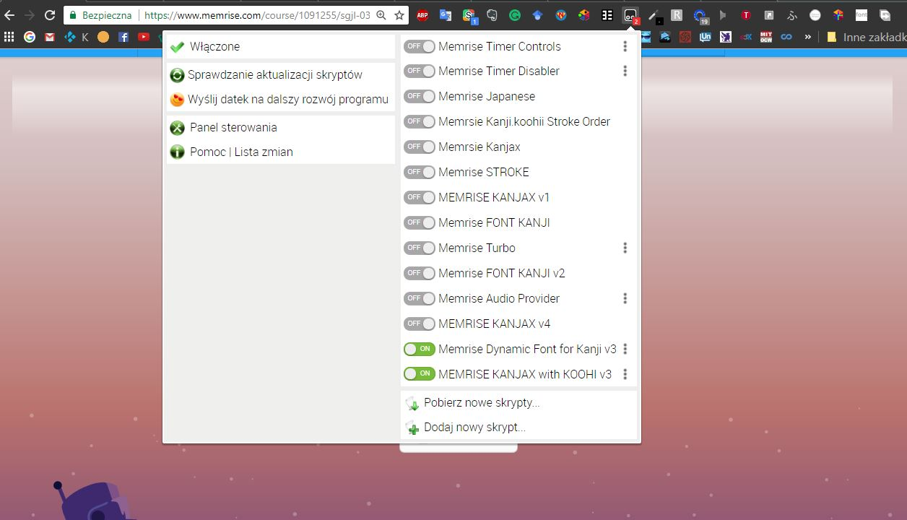
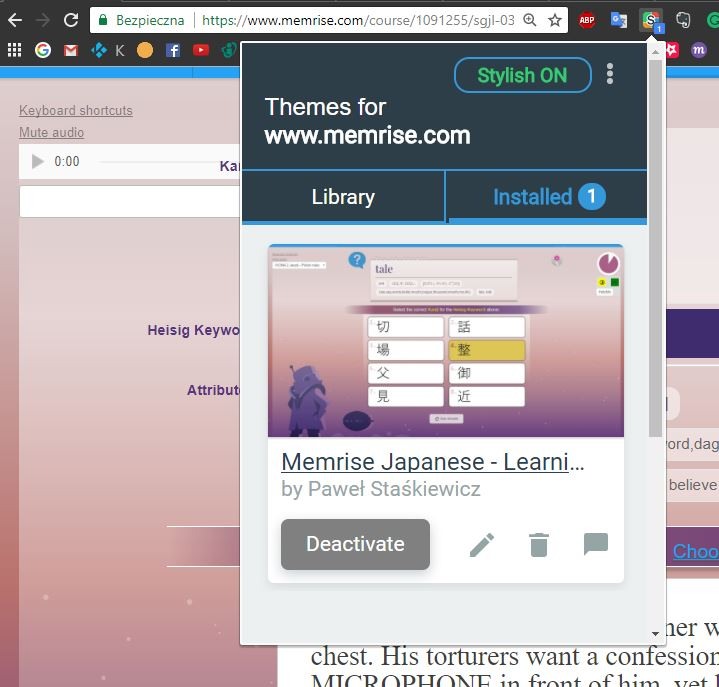

Works only in <strong>CHROME BROWSER</strong>, i tested it only in <strong>WINDOWS</strong>

## Description:

This scripts will change look of your memrise more or less it depends if you will use userstyle (Stylish addon). It will adjust font size of text depends of number of characters and words in a single question box. Also you will be able to interact with any Kanji character to see kanji strokes information, kunyomi/onyomi readings and some stories about this Kanji.

 
More screenshoots: http://imgur.com/a/kcftf
 
 
# INSTRUCTIONS:
<strong>DOWNLOAD ALL of this:</strong>

## Fonts (Microsoft Office Japanese Fonts, Stroke order font):

<ul>
<li>https://www.microsoft.com/en-us/download/details.aspx?id=49114</li>
<li>http://www.nihilist.org.uk/</li>
</ul>

## Extensions:

### Memrise+
https://chrome.google.com/webstore/detail/memrise+/hmpiegnknhdokbhnifbpgbbfkeddbdfh

### Tampermonkey
​https://chrome.google.com/webstore/detail/tampermonkey/dhdgffkkebhmkfjojejmpbldmpobfkfo

### Stylish - Custom themes for any website
​https://chrome.google.com/webstore/detail/stylish-custom-themes-for/fjnbnpbmkenffdnngjfgmeleoegfcffe

### Web Server for Chrome
https://chrome.google.com/webstore/detail/web-server-for-chrome/ofhbbkphhbklhfoeikjpcbhemlocgigb

Set your server as: http://127.0.0.1:8887 and set Webserver in folder <strong>C:\KANJAX\    REALLY IMPORTANT!!!</strong>

From here (my github) download and put it in your WEBSERVER FOLDER:

https://github.com/superpawko/Memrise_Dynamic_Font__with_Koohi/blob/master/KANJAX.zip

<strong>Unpack to folder on C:\   [REALLY IMPORTANT]</strong>

This is how look your directory structure. In Frames folder there should be 6000+ files of .svg

## Install userscripts:

### UserScripts:

<ul>
<li>https://greasyfork.org/pl/scripts/31168-memrise-dynamic-font-for-kanji-v3</li>
<li>https://greasyfork.org/pl/scripts/31169-memrise-kanjax-with-koohi-v3</li>
</ul>

<strong>OPTIONAL:</strong> [It will make kanji popup on everywebsite.
https://greasyfork.org/pl/scripts/31167-kanjax-on-all-websites-v2

### Install userstyle:
https://userstyles.org/styles/144287/memrise-japanese-learning-kanji-with-sjgl

## What i used: 
<ul>
<li>https://github.com/KanjiVG/kanjivg</li>
<li>https://github.com/Kimtaro/kanjivg2svg</li>
<li>Kanji_koohi javascript but i do not know autor or place where i get it.</li>
</ul>

 

 

## ADDITIONAL SETTINGS:

### WATCHOUT ON KANJAX on all Websites v2

<strong>This is script will try to find kanji on every webpage load. Disable it if not needed or add your favourite website inside script @match tag.</strong>

### MEMRISE+

Right click on extension and choose options/settings.

### Webserver

If you want to edit settings of webserver you have to go to: <strong>chrome://apps</strong>

### How to turn off scripts

Go to website run course and than click on Tampermonkey extension.

### How to turn off STYLE off a webpage (CSS)

### How to make script work only on few courses:

Click on tapermonkey - > Click on Dashboard - > On right side of every script there are 3 buttons. Press Edit button of choosen script. 

Change line 7 :
 
// @match        \*://www.memrise.com/course/\*
 
to:
 
// @match        \*://www.memrise.com/course/1091255/\*

Where  <strong>1091255</strong> is a course number:

 

# Buy me a beer :) 
<em>I'm unemployed so every $ matters. Thanks! </em>
<a href="https://www.paypal.com/webapps/shoppingcart?flowlogging_id=592551565e840&mfid=1499250036760_592551565e840#/checkout/openButton"> <strong>Make Donation</strong></a>
